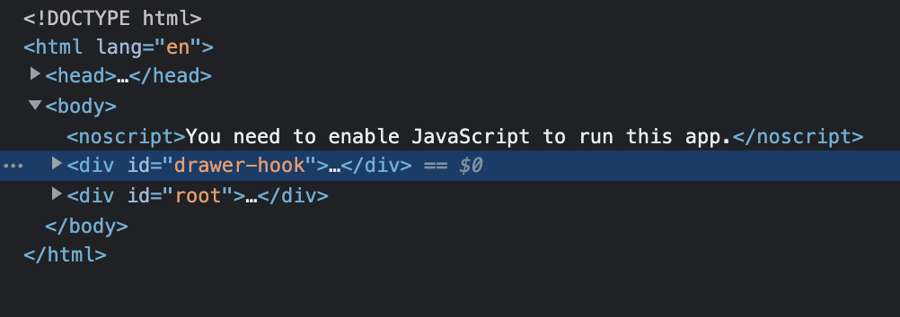
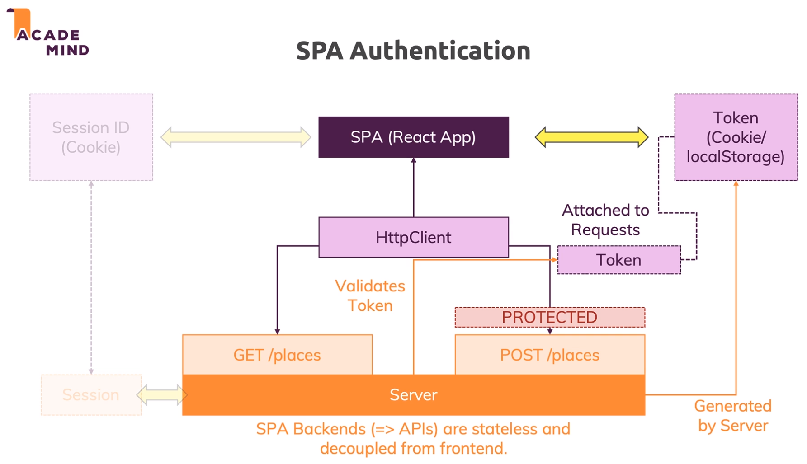
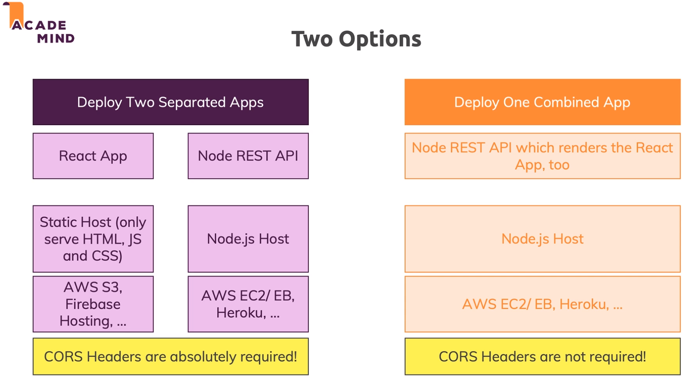

## About The Project

- React, NodeJS, Express & MongoDB - The MERN Fullstack Guide
- Build fullstack React.js applications with Node.js, Express.js & MongoDB (MERN) with this project-focused course
- Tutorial for YourPlaces ([Firebase + Heroku Demo](https://your-places-09-apr-2022-2.web.app/))
- [Maximilian Schwarzmüller](https://github.com/maxschwarzmueller)
- [Manuel Lorenz](https://academind.com/)
- [Academind](https://academind.com/)

&nbsp;

## Installation

1. Install NPM packages.

```sh
npm install
```

2. Rename <code>.env.temp</code> to <code>.env</code>
3. Fill in the respective fields in the .env files (frontend & backend)

&nbsp;

## Notes

### ReactDOM.createPortal(child, container)

- Move overlay (e.g. SideDrawer.js) under <code>body</code>



### useEffect()

- Hooks are an important concept in modern React - they allow you to add various functionalities to functional components. And that's important: <b>Only to functional components.</b>

- <i>If you're building class-based components (which you also can), you can't use hooks - you got different APIs there.</i>

- <code>useState()</code> allowed us to register state which then is managed inside of a component. When state is changed, the component re-renders (or to be precise: It is re-evaluated and might lead to a re-rendering of the DOM).

- <code>useEffect()</code> does something different: It allows you to <b>register some logic</b> (i.e. a JS function) which will be executed when certain <b>dependencies</b> - which you define - change.
- Let's have a look at the <code>Map</code> example:

```js
useEffect(() => {
  const map = new window.google.maps.Map(mapRef.current, {
    center: center,
    zoom: zoom,
  });

  new window.google.maps.Marker({ position: center, map: map });
}, [center, zoom]);
```

- The logic here (i.e. the function) is to render a map + a marker on the map. The dependencies, that define when this logic should re-run, are our <code>center</code> and <code>zoom</code> variables. Whenever at least one of these two dependencies changes, the function re-runs. And that makes sense: If we got a new center or zoom level, we want to re-render the map!

- However, React does not track these dependencies behind the scenes. Instead, <code>useEffect()</code> re-evaluates the dependency values whenever the component in which you use <code>useEffect()</code> is re-evaluated (i.e. whenever the component's props or state changed).

- If the component is re-evaluated and the dependencies did NOT change, the logic in <code>useEffect()</code> won't run again.

- Important: The <code>useEffect()</code> logic re-runs <b>AFTER</b> the component (including its JSX code) was re-evaluated. That means, that the first execution of the <code>useEffect()</code> logic (when a component mounts for the first time) will <b>ALWAYS</b> happen <b>AFTER</b> the component rendered for the first time.

&nbsp;

---

&nbsp;

### Custom Hooks

- You can build a hook that uses other built-in hooks (like <code>useState()</code>) and any component that uses your hook will then use the built-in hooks you might be using in your custom hook as well.

- This allows you to build hooks like the <code>useForm()</code> hook we started to build in the previous lecture. The idea here is that we can share our stateful form logic (that uses <code>useReducer()</code> in our case) across components. This avoids code duplication, makes it easy to change the code and leads to more readable code.

- With all that "custom hook" jargon, it's easy to overlook that custom hooks in the end are normal JavaScript functions though - never forget that!

- If you use <code>useForm()</code> in your component function, it will get called for every re-evaluation of your component (i.e. for every re-render cycle). Hence all the logic in a custom hook runs every time your component function is executed.

- Of course a lot of built-in hooks like <code>useState()</code> or <code>useReducer()</code> have mechanisms to ensure that state changes are kept across re-render cycles.

&nbsp;

### Custom Error

- [MDN - Custom Error](https://developer.mozilla.org/en-US/docs/Web/JavaScript/Reference/Global_Objects/Error#custom_error_types)
- [SO - How to reject in async/await syntax?](https://stackoverflow.com/questions/42453683/how-to-reject-in-async-await-syntax)

&nbsp;

> <b>Elson:</b> Difference between Throw error and returning next(error)

> <b>Maximilian:</b> Yes, absolutely - and we do highlight that in the course. In an async task (e.g. in a promise), you need to use next(error) - throw error will NOT cause the error handling middleware to become active.

&nbsp;

---

&nbsp;

### NOSQL VS SQL

|                  NOSQL                   |                      SQL                      |
| :--------------------------------------: | :-------------------------------------------: |
|             MongoDB, CouchDB             |                 MySQL, MS SQL                 |
|         Enforces no Data Schema          |         Enforces a Strict Data Schema         |
|        Less Focused on Relations         |         RElations are a Core Feature          |
|         "Independent Documents"          |              Records are Related              |
| Great for: Logs, Orders, (Chat) Messages | Great for: Shopping Carts, Contacts, Networks |

&nbsp;

> <b>James: </b>Bcrypt vs Crypto

> <b>Adam: </b>The native crypto module is too fast at creating its hashes so it's not something you want to use for hashing passwords. You want something on the slower end like bcrypt or agron2 to help mitigate brute force attacks.

&nbsp;

---

&nbsp;

### Transactions

- [mongoose transactions](https://mongoosejs.com/docs/transactions.html)

> <b>Artur: </b>Potential security leak with populate()

> Bare in mind that if you use populate() the referenced object is inserted as-is. Thus, if we return the delete place to the frontend (for a notification for example), the creator is exported in the JSON as well. Together with the password of course.

> <b>Adam: </b>You can specify the fields you want to exclude from .populate() as its second parameter:

```js
.populate('something', '-field1 -field2')
```

&nbsp;

---

&nbsp;

> <b>Guilherme: </b>For which reason a session has to be started?

> <b>Jost: </b>In general (not specific to MongoDB), if you have multiple database accesses, it is safer to do this in a transaction. In this way the related parts are prevented from being modified by another user, until the transaction is finished.

> A simple real world example would be that two persons want to take out money from the same account, using two different cash machines. Without blocking the access until the first person has finished the whole transaction, it might happen that both get the same account status of 100$ displayed in the beginning, and then both draw 100$ from this account without being aware of the fact that the account is in the red in the end.

> <b>BTW:</b> Remember that the problem arises since the database access is asynchronous. For the same reason we don't need transactions for accessing the browser's localStorage (synchronous), but we need transactions for accessing the browser's IndexedDB (asynchronous).

&nbsp;

---

&nbsp;

> <b>Artur: </b>Do we need session.endSession()?

> <b>Adam: </b>Nope, sessions are also closed during garbage collection so it doesn't need to be called.

&nbsp;

---

&nbsp;

### Avoid setting state on an unmounted component

- [MDN - AbortController](https://developer.mozilla.org/en-US/docs/Web/API/AbortController)
- [Jost (stackblitz): react-prevent-unmounted-component-error](https://stackblitz.com/edit/react-prevent-unmounted-component-error?file=Functional.js)

&nbsp;

### Image File Upload

- [MDN - FileSystem API](https://developer.mozilla.org/en-US/docs/Web/API/FileSystem)
- [MDN - URL API (URL.createObjectURL())](https://developer.mozilla.org/en-US/docs/Web/API/URL)
- [MDN - FormData API](https://developer.mozilla.org/en-US/docs/Web/API/FormData)

&nbsp;

### Authentication



> <b>Charles: </b> Is it a best practice to store a JWT in the user's local storage?

> <b>Jost: </b> In his Angular Complete Guide course Max answered to a similar question like this:

> "It's an old discussion - unfortunately with a lot of incomplete information.

> 1. Angular protects you against XSS: By default, unless you deliberately circumvent it, you can't (!) output malicious code with Angular. Angular sanitizes output before it renders it. Of course, there are other possible ways of launching a XSS attack, most notably via a third-party library which got hacked. So let's have a look at 2).

> 2. If your page is vulnerable to XSS, you'll have bigger problems than exposed user session data. Sure, it could be stolen and used but tokens expire after a short duration (typically 1 hour). A cookie would not protect you here, that's a common misconception. Even if it's a httpOnly cookie (which by the way won't allow you to interact with it via Angular - opening up new problems when it comes to managing the user auth state, but that's a different topic).

> Why could you run into issues with a httpOnly cookie? Well, it can't be retrieved via JS (and hence not via a XSS attack) but what is stopping an XSS attacker from simply sending a fetch() request via JS to a server and attach the httpOnly cookie. Nothing, right? An XSS attacker can do whatever you can do with Angular, too.

> So it simply does not matter => You have to protect against XSS and Angular makes that simple. localStorage vs Cookies => It does not matter. localStorage is easier to use, hence we use that.

> Max"

> And in his MEAN stack course Max answered in a similar way:

> "I'm not convinced by the [article](https://dev.to/rdegges/please-stop-using-local-storage-1i04) to be honest. The core essence is: Don't use localStorage because you're vulnerable to XSS. But of course the goal is to protect against XSS and Angular apps are protected by default. Unless you manually overwrite the security model provided by Angular, JS code can't be rendered to the screen, user-created content can't contain JS code (that could be executed).

> I still agree that you shouldn't start storing passwords or credit card data but I don't see an issue with the JWT. You need to store it somewhere because SPAs + API backends don't use session (as the backend is stateless). If you use a cookie, you still need to access it via JS, hence you again have the same XSS issue (=> which shouldn't really exist as mentioned before).

> Last but not least, JWT expire quickly. That's part of their security model. Obviously it's not enough standalone but combined with XSS protection and that you should of course use SSL for your requests, I'm not convinced that localStorage is a bad choice here.

> I read the argument about third-party packages being infiltrated but guess what: If that happened, localStorage is your smallest issue. If the Angular package itself was infiltrated, people can log every input of the user. People can show fake login forms and fetch the real password etc. We're not talking about localStorage security issues then. This is a real problem with all the dependencies of modern frontend apps though. I won't argue against that. But it's a bigger problem we have to be aware of than just about where we store our tokens.

> Max"

&nbsp;

---

&nbsp;

> <b>정성문: </b> shouldn't we set expiration date on the backend?
> <b>정성문: </b> If we set Exp date of login on the front, isn't it possible for users to modify the exp. date on purpose? (eg. like 10yrs) I thought exp date should be included in the encrypted jwt token we send to the user when logging in.

> <b>Jost: </b> Yes, we could decode the expiration date from the token on the frontend. https://www.udemy.com/course/react-nodejs-express-mongodb-the-mern-fullstack-guide/learn/lecture/16916242#questions/8816256

> But that wouldn't prevent a user from manipulating this in the frontend. The general rule is:

> For security reasons, since you can't protect the frontend against being compromised, you always have to make sure on the server side that a user can only access the content for which he or she is authorized. What we do on client side is just a matter of convenience (not security relevant), for example hiding a button that would cause a request which the server would reject anyways in this situation.

&nbsp;

---

&nbsp;

### Deployment



- Steps for deploying 2 apps separately using this repo without Git subtree
- <b>Idea</b>: 3 folders: 1) <code>your-place</code> (GitHub repo) 2) <code>backend</code> (Heroku) <code>frontend (Firebase)

  - Duplicate both <code>frontend and <code>backend</code> folders repectively.
  - Copy over the files (e.g. package.json) from root directory (<code>your-place</code> folder) to the newly created <code>backend</code> folder.
  - Deploy <code>backend</code> folder to heroku.

    - Use the code below to fix the path for images & avatar:

    ```js
    // Replace './backend/uploads/images'
    // Replace './backend/uploads/avatar'

    './uploads/images';
    './uploads/avatar';

    // Append image: 'backend/' + req.file.path & "avatar: req.file.path" as below
    image: 'backend/' + req.file.path,
    avatar: 'backend/' + req.file.path,
    ```

  - Deploy <code>frontend</code> folder. Refer to commands below for testing before deploying.
    ```sh
    npm run build
    npx serve build
    ```

&nbsp;
